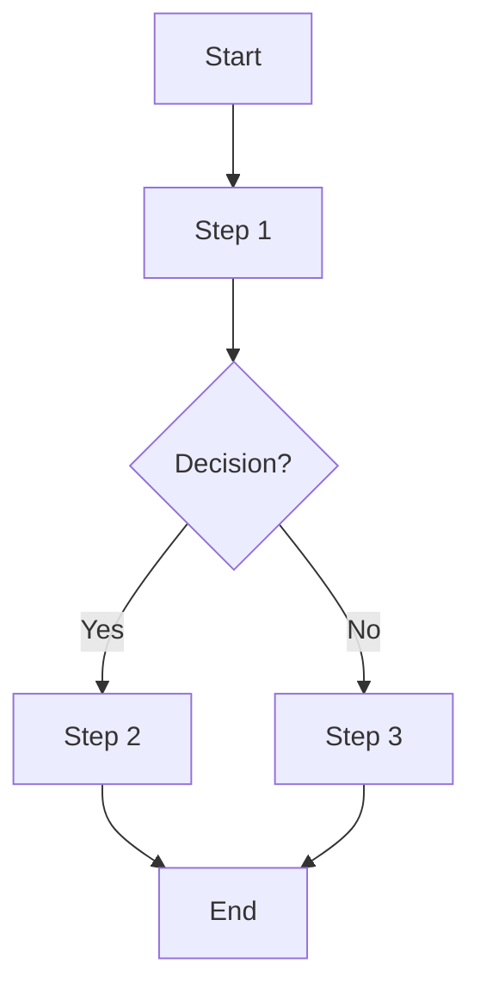

personrepo
==========

repository for sample projects

https://github.com/PacktPublishing/Modern-API-Development-with-Spring-6-and-Spring-Boot-3

https://github.com/Apress/spring-rest-2e

https://github.com/PacktPublishing/Software-Architecture-with-Spring-6.0

https://github.com/PacktPublishing/Mastering-RESTful-Web-Services-with-Java

https://github.com/PacktPublishing/Java-Coding-Problems

https://github.com/PacktPublishing/Microservices-with-Spring-Boot-and-Spring-Cloud-Third-Edition

https://github.com/PacktPublishing/Java-Concurrency-and-Parallelism

https://github.com/PacktPublishing/Learn-Java-with-Projects

https://github.com/PacktPublishing/Spring-Security-Fourth-Edition

https://github.com/Apress/Java-23-for-Absolute-Beginners

https://github.com/Apress/Pro-Spring-Boot-3

https://github.com/Apress/spring-5-recipes

https://github.com/Apress/Learn-Java-Fundamentals

https://github.com/Apress/Software-Development-Design-and-Coding-3rd-ed

https://github.com/Apress/Beginning-Spring-6-2nd-ed.

https://github.com/Apress/pro-spring-6

https://github.com/Apress/Learn-Microservices-with-Spring-Boot-3-3rd-ed

https://github.com/Apress/Pro-Spring-Security-3rd-ed.

https://github.com/Apress/Practical-Spring-LDAP-2nd-ed.

https://github.com/Apress/software-development-from-a-to-z

https://github.com/Apress/reactive-streams-in-java

https://github.com/Apress/building-an-enterprise-chatbot

https://github.com/Apress/spring-6-recipes

https://github.com/Apress/Learn-API-Testing

https://github.com/Apress/java-17-for-absolute-beginners

https://github.com/Apress/Learn-API-Testing.git

https://github.com/ThomasVitale/cloud-native-spring-in-action.git

