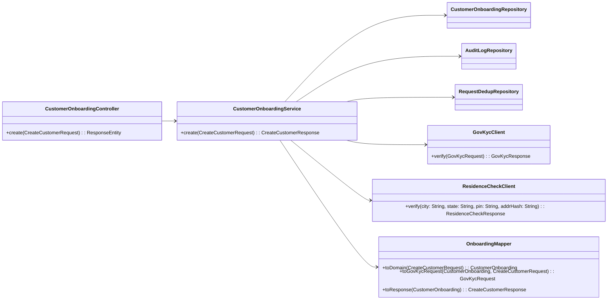

Awesome — here’s your **final BRM** (Swagger section excluded) with a new **Database Schema** section at the end. It’s ready for GPT-driven code generation (Spring Boot controllers/services/transactions/clients/mappers/tests), Postman collection generation, and automated test scaffolding.

---

# BRM: Bank Onboarding – Customer Create

## 0. Meta

* **Domain**: Banking → Customer → Onboarding
* **Version**: v1.0
* **Owner**: Onboarding Team
* **Target Module**: `com.acme.onboarding`
* **Code Anchors**

  * Controller: `com.acme.onboarding.api.CustomerOnboardingController`
  * Service: `com.acme.onboarding.service.CustomerOnboardingService`
  * Mapper: `com.acme.onboarding.mapper.OnboardingMapper`
  * Clients:

    * `com.acme.onboarding.client.GovKycClient`
    * `com.acme.onboarding.client.ResidenceCheckClient`
  * Entities: `com.acme.onboarding.domain.*`
  * Repositories: `com.acme.onboarding.repo.*`
  * Exception Handler: `com.acme.onboarding.api.RestExceptionHandler`

---

## 1. Business Goal

Create a new customer onboarding record atomically. Validate identity via Government KYC (POST) and verify residence via Address Service (GET). If any validation fails or an external call is inconclusive/timeout (after retries), onboarding **must not** complete. Persist audit trail and ensure **idempotency** with `X-Request-Id`.

---

## 2. Contracts (Public API)

### 2.1 Request

* **HTTP**: `POST /api/onboarding/customers`
* **Headers (required)**:

  * `Authorization: Bearer <JWT>`
  * `Content-Type: application/json`
  * `X-Request-Id: <UUID>` (idempotency)
* **DTO**: `CreateCustomerRequest`

```json
{
  "customerId": "C12345",
  "fullName": "Ravi Kumar",
  "email": "ravi.kumar@example.com",
  "mobile": "9876543210",
  "pan": "ABCDE1234F",
  "dob": "1992-08-17",
  "address": {
    "line1": "12 MG Road",
    "line2": "Near Park",
    "city": "Bengaluru",
    "state": "KA",
    "pinCode": "560001"
  }
}
```

**Field Rules (summary)**

* `customerId` non-blank, max 32
* `fullName` non-blank
* `email` RFC 5322; unique
* `mobile` 10 digits, starts 6–9
* `pan` `[A-Z]{5}[0-9]{4}[A-Z]`
* `dob` ISO `yyyy-MM-dd` (18+ years)
* `address.*` non-blank; `pinCode` 6 digits

### 2.2 Response (201)

```json
{
  "referenceId": "ONB-2025-000019",
  "status": "CREATED",
  "kycStatus": "KYC_PASSED",
  "residenceStatus": "RESIDENCE_VERIFIED"
}
```

### 2.3 Error Response (common schema)

```json
{
  "timestamp": "2025-10-30T10:12:45Z",
  "requestId": "0f4b4c1d-...",
  "code": "PAN_INVALID",
  "message": "Invalid PAN format",
  "details": { "field": "pan" },
  "path": "/api/onboarding/customers"
}
```

---

## 3. Domain Model

| Entity               | Field                             | Type                                                          | Constraints      | Notes              |
| -------------------- | --------------------------------- | ------------------------------------------------------------- | ---------------- | ------------------ |
| `CustomerOnboarding` | id                                | Long                                                          | PK               |                    |
|                      | customerId                        | String                                                        | not null, unique | external reference |
|                      | fullName                          | String                                                        | not null         |                    |
|                      | email                             | String                                                        | unique, not null |                    |
|                      | mobile                            | String                                                        | not null         |                    |
|                      | pan                               | String                                                        | not null         |                    |
|                      | dob                               | LocalDate                                                     | not null         |                    |
|                      | addressLine1/2/city/state/pinCode | String                                                        | not null         |                    |
|                      | kycStatus                         | Enum(KYC_PENDING, KYC_PASSED, KYC_FAILED)                     | not null         |                    |
|                      | residenceStatus                   | Enum(RESIDENCE_PENDING, RESIDENCE_VERIFIED, RESIDENCE_FAILED) | not null         |                    |
|                      | status                            | Enum(CREATED, FAILED)                                         | not null         |                    |
| `AuditLog`           | id                                | Long                                                          | PK               |                    |
|                      | event                             | String                                                        | not null         |                    |
|                      | payload                           | JSON                                                          |                  | redacted PII       |

---

## 4. Orchestration Workflow (Deterministic)

> Service: `CustomerOnboardingService.create(CreateCustomerRequest req)`
> Transaction: `@Transactional(rollbackFor = Exception.class)`

**Steps**

1. **Validate** request (bean + custom rules).
2. **Idempotency check** (`X-Request-Id`) → return stored response if present.
3. **Persist** initial `CustomerOnboarding` with `KYC_PENDING`, `RESIDENCE_PENDING`.
4. **Gov KYC (POST)**: map request; call; map response→domain; handle retry/timeout.
5. **Residence Check (GET)**: map query; call; map response→domain; handle retry/timeout.
6. **Decide**: both must pass → `CREATED`; else `FAILED` (rollback).
7. **Audit**; **commit**.
8. **Return** response DTO.

---

## 5. Non-Functionals

* **SLO**: p95 ≤ 300ms (no partner) / ≤ 1200ms (with both)
* **Security**: JWT scope `onboarding:create`
* **Observability**: Micrometer + OTel; structured logs; trace partner calls
* **PII**: redact PAN/mobile in logs (`ABCDE*****F`, `98******10`)

---

## 6. External Integrations

### 6.1 Government KYC API (POST)

* **Endpoint**: `POST https://api.gov.example/kyc/verify`
* **Timeout**: 2000 ms | **Retries**: 2 | **CircuitBreaker**: open after 5 failures / 30s
* **Headers**: `X-API-KEY`, `X-CORRELATION-ID`
* **Request DTO**: `GovKycRequest` → `{ pan, fullName, dob, mobile }`
* **Success (200)**: `GovKycResponse` → `{ result: PASS|FAIL, riskScore, txnId }`
* **Errors**

  * 400: invalid PAN/name/dob → `PAN_INVALID` / `DOB_INVALID` (400)
  * 429/5xx/timeout: transient → retry; then `EXTERNAL_KYC_UNAVAILABLE` (503/504)

**Mapping (6.1.1)**

| From             | To             | Rule         |
| ---------------- | -------------- | ------------ |
| `result=="PASS"` | `kycStatus`    | `KYC_PASSED` |
| `result=="FAIL"` | `kycStatus`    | `KYC_FAILED` |
| `riskScore`      | `kycRiskScore` | copy         |
| `txnId`          | `kycRef`       | copy         |

### 6.2 Residence Check API (GET)

* **Endpoint**: `GET https://res.example/verify?city={city}&state={state}&pin={pin}&addr={addrHash}`
* **Timeout**: 1500 ms | **Retries**: 1 | **CircuitBreaker**: open after 5 failures / 30s
* **Success (200)**: `ResidenceCheckResponse` → `{ verified: boolean, confidence: number, ref }`
* **Errors**

  * 404: locality not found → `RESIDENCE_FAILED` (422 or 200-with-failure-flag)
  * 429/5xx/timeout: retry then `EXTERNAL_RES_UNAVAILABLE` (503/504)

**Mapping (6.2.1)**

| From                                | To                | Rule                 |
| ----------------------------------- | ----------------- | -------------------- |
| `verified==true && confidence>=0.8` | `residenceStatus` | `RESIDENCE_VERIFIED` |
| else                                | `residenceStatus` | `RESIDENCE_FAILED`   |
| `ref`                               | `residenceRef`    | copy                 |

---

## 7. Validation (Controller + Service)

### 7.1 Bean Validation (Controller DTO)

* `@NotBlank`, `@Email`, `@Pattern` (PAN/mobile), `@Past` (dob), nested `@Valid` for address.

### 7.2 Custom Rules (Service)

| Id  | Rule                          | Error Code        | HTTP |
| --- | ----------------------------- | ----------------- | ---- |
| V01 | Age < 18 not allowed          | AGE_RESTRICTION   | 422  |
| V02 | Duplicate `customerId` active | DUPLICATE         | 409  |
| V03 | Email/mobile already used     | DUPLICATE_CONTACT | 409  |

---

## 8. JSON ↔ DTO ↔ Domain Mapping

* **Controller (JSON→DTO)**: Jackson, `FAIL_ON_UNKNOWN_PROPERTIES=true`.
* **DTO→Domain (Mapper)**: `OnboardingMapper.toDomain(CreateCustomerRequest)`

  * Trim strings, uppercase PAN/state, compute `addrHash=sha256(line1|line2|city|state|pin)`.
* **Domain↔Client DTOs**:

  * `toGovKycRequest(domain, dto)`; `addrToResidenceQuery(domain)`
* **Domain→Response**: `OnboardingMapper.toResponse(CustomerOnboarding)`.

---

## 9. Error Model (Public)

| Code                     | Message                               | HTTP    | Retryable |
| ------------------------ | ------------------------------------- | ------- | --------- |
| PAN_INVALID              | Invalid PAN format                    | 400     | N         |
| MOBILE_INVALID           | Invalid mobile format                 | 400     | N         |
| DOB_INVALID              | Invalid or future DOB                 | 400     | N         |
| AGE_RESTRICTION          | Must be 18+                           | 422     | N         |
| DUPLICATE                | Customer already exists               | 409     | N         |
| DUPLICATE_CONTACT        | Email/Mobile already used             | 409     | N         |
| EXTERNAL_KYC_UNAVAILABLE | Gov KYC unavailable/timeout           | 503/504 | Y         |
| EXTERNAL_RES_UNAVAILABLE | Residence service unavailable/timeout | 503/504 | Y         |
| KYC_FAILED               | Government KYC failed                 | 422     | N         |
| RESIDENCE_FAILED         | Residence verification failed         | 422     | N         |
| MAPPING_ERROR            | Unable to map partner response        | 502     | N         |
| TX_ROLLBACK              | Transaction failed                    | 500     | Maybe     |
| UNKNOWN                  | Unknown error                         | 500     | N         |

**Error JSON Schema**: `timestamp, requestId, code, message, details, path`.

---

## 10. Logging & Observability (Layer-wise)

**Common fields**: `ts`, `level`, `logger`, `requestId`, `traceId`, `spanId`, `actor`, `customerId`, `operation`, `latencyMs`, `code`.
**Message Keys**

* Controller: `API_REQ_RECEIVED`, `API_REQ_VALIDATION_FAILED`, `API_RESP_SENT`
* Service: `SVC_START`, `SVC_DECISION`, `SVC_ERROR`
* Tx: `TX_BEGIN`, `TX_COMMIT`, `TX_ROLLBACK`
* Clients: `CLIENT_REQ`, `CLIENT_RESP`, `CLIENT_RETRY`, `CLIENT_CIRCUIT_OPEN`
* Mapper: `MAP_IN`, `MAP_ERROR`
* Util: `UTIL_ACTION`

**PII redaction**: PAN `ABCDE*****F`, mobile `98******10`.
**Tracing**: OTel spans around external calls; metrics `govkyc.latency`, `residence.latency`, `onboarding.create.latency`.

---

## 11. Exception Handling (Layer-wise)

* **Controller**: `MethodArgumentNotValidException` → 400; `HttpMessageNotReadableException` → 400.
* **Service**: `BusinessRuleViolationException(code, details)` → 4xx/422; `ExternalServiceException(code=EXTERNAL_*)` → 503/504; unexpected → `InternalErrorException(UNKNOWN)`.
* **Transaction**: `@Transactional(rollbackFor = Exception.class)`; rollback on `ExternalServiceException`/`RuntimeException`.
* **Repository**: `DataIntegrityViolationException` → `DUPLICATE` (409).
* **Mapper**: `MappingException` → `MAPPING_ERROR` (502).
* **Global**: `RestExceptionHandler` maps to §9 schema; log `SVC_ERROR`.

---

## 12. Idempotency & Concurrency

* Require `X-Request-Id` (UUID); interceptor persists dedup record in `request_dedup`.
* On duplicate key → return stored response; **do not** call partners again.
* DB isolation: `READ_COMMITTED`.

---

## 13. Persistence & Repos

* `CustomerOnboardingRepository`

  * `findByCustomerId(String)`
  * `existsByEmailOrMobile(String, String)`
  * `save`, `saveAndFlush`
* `AuditLogRepository` → `save(AuditLog)`
* `RequestDedupRepository` → `findById`, `save`

---

## 14. Test Matrix

* **T01** Valid → KYC PASS + Residence PASS → 201 CREATED
* **T02** PAN invalid → 400
* **T03** Age < 18 → 422
* **T04** Duplicate customerId → 409
* **T05** Gov KYC 5xx then success on retry → 201
* **T06** Gov KYC permanent 400 → 400 `PAN_INVALID`
* **T07** Residence verified=false → 422 `RESIDENCE_FAILED`
* **T08** Residence 5xx/timeout after retry → 503/504 `EXTERNAL_RES_UNAVAILABLE`
* **T09** Mapping error (unexpected enum) → 502 `MAPPING_ERROR`
* **T10** Idempotent same `X-Request-Id` → cached response

---

## 15. Mermaid Class Diagram



---

## 16. Mermaid Sequence Diagram


---

## 17. Code-Generation Hints

Generate:

* `@RestController` + `@Validated` + `@ControllerAdvice`
* `@Service` with `@Transactional(rollbackFor=Exception.class)`
* MapStruct `OnboardingMapper` (`@AfterMapping` for redactions & `addrHash`)
* Feign/WebClient clients with Resilience4j (`retry`, `circuitBreaker`, `timeout`)
* Idempotency interceptor/filter + `request_dedup` JPA entity & repo
* DTOs with JSR-380 annotations; Jackson rejects unknowns
* Structured logging with message keys (§10); MDC: `requestId`, `traceId`

---

## 18. Validation Against Existing Code

* `CustomerOnboardingService.create()` is transactional
* `GovKycClient` timeout ≤ 2s, retry=2, CB enabled
* `ResidenceCheckClient` timeout ≤ 1.5s, retry=1, CB enabled
* `OnboardingMapper` covers mappings (§6.1.1, §6.2.1)
* `RestExceptionHandler` returns §2.3 schema + §9 codes
* Idempotency store invoked before partner calls
* Logs include message keys & `requestId`

If mismatches exist, propose minimal additive patches.

---

## 19. Postman Collection — Generation Spec (Instructions)

**Goal:** Generate a Postman v2.1 collection & environment to test all success/negative/idempotent paths.

**Inputs**: §§2, 6, 9, 12, 14, 17–18.
**Deliverables**:

* `onboarding.postman_collection.json`
* `onboarding.postman_environment.json`
* *(optional)* CSV for data-driven negatives

**Environment variables (must include)**: `baseUrl`, `authToken`, `requestId`, `customerId`, `email`, `mobile`, `pan`, `dob`, `pinCode`, `city`, `state`.

**Structure**:

* Folder `Onboarding` with requests:

  * Happy Path (201), Invalid PAN (400), Underage (422), Duplicate (409),
  * Residence Timeout (503/504), Idempotent Replay (200/201)

**Scripts**:

* **Pre-request**: ensure `requestId` (UUID) + randomized payload atoms.
* **Tests**: assert status, `x-request-id`, and body (success fields or error `code` ∈ §9).
  **CLI**: Provide a `newman` command; exit non-zero on failures.
  **Acceptance**: Imports cleanly; all scenarios pass against compliant implementation.

---

## 20. Test Automation — Generation Spec (Instructions)

**Goal:** Generate an executable automated suite for local & CI.

**Default stack**: Java 17 + JUnit 5 + RestAssured (+ JSON Assert).
**Options**: Karate profile; WireMock if partners unavailable.

**Outputs**:

* Test module `/onboarding-tests` (or `/it-tests`)
* Tests under `.../api/CreateCustomerTests.java` *(or `onboarding.feature`)*
* Payload fixtures in `/src/test/resources/payloads/`
* *(If stubs)* WireMock mappings in `/src/test/resources/wiremock/`

**Config**:

* `baseUrl`, `token` via system props/env; generate `X-Request-Id` per test.

**Scenarios**: Mirror §14 T01–T10 (happy/negatives/retry/mapping/idempotency).
**Assertions**: HTTP codes; `x-request-id` echo; body fields/enums; error `code` ∈ §9.
**Idempotency**: compare first vs second response by same `X-Request-Id`.
**Resilience**: verify retry effect or diagnostic headers if exposed.
**CI**: Provide single Maven command; emit JUnit XML.
**Gates**: all §14 scenarios must pass; optional nightly SLO p95 checks.

---

## 21. Database Schema

> **Target DB**: PostgreSQL 14+ (adjust types for MySQL if needed).
> **Migrations**: Provide **Flyway** scripts `V1__onboarding_core.sql`, `V2__idempotency.sql`, etc.
> **Notes**: Use UTC timestamps; soft PII handling (mask PAN/mobile in logs; store raw in DB where legally permitted).

### 21.1 DDL – Core Tables

```sql
-- V1__onboarding_core.sql
CREATE TABLE customer_onboarding (
  id                BIGSERIAL PRIMARY KEY,
  reference_id      VARCHAR(32) NOT NULL UNIQUE,              -- e.g., ONB-2025-000019
  customer_id       VARCHAR(32) NOT NULL UNIQUE,
  full_name         VARCHAR(200) NOT NULL,
  email             VARCHAR(320) NOT NULL UNIQUE,
  mobile            VARCHAR(16)  NOT NULL,
  pan               VARCHAR(10)  NOT NULL,
  dob               DATE         NOT NULL,

  address_line1     VARCHAR(200) NOT NULL,
  address_line2     VARCHAR(200),
  city              VARCHAR(100) NOT NULL,
  state             VARCHAR(64)  NOT NULL,
  pin_code          VARCHAR(6)   NOT NULL,

  addr_hash         CHAR(64)     NOT NULL,                    -- sha256(line1|line2|city|state|pin)
  kyc_status        VARCHAR(16)  NOT NULL CHECK (kyc_status IN ('KYC_PENDING','KYC_PASSED','KYC_FAILED')),
  residence_status  VARCHAR(24)  NOT NULL CHECK (residence_status IN ('RESIDENCE_PENDING','RESIDENCE_VERIFIED','RESIDENCE_FAILED')),
  status            VARCHAR(16)  NOT NULL CHECK (status IN ('CREATED','FAILED')),

  kyc_risk_score    INTEGER,
  kyc_ref           VARCHAR(64),
  residence_ref     VARCHAR(64),

  created_at        TIMESTAMPTZ  NOT NULL DEFAULT NOW(),
  updated_at        TIMESTAMPTZ  NOT NULL DEFAULT NOW()
);

CREATE INDEX idx_onb_email      ON customer_onboarding(email);
CREATE INDEX idx_onb_mobile     ON customer_onboarding(mobile);
CREATE INDEX idx_onb_addr_hash  ON customer_onboarding(addr_hash);

CREATE OR REPLACE FUNCTION trg_onb_touch_updated_at()
RETURNS TRIGGER LANGUAGE plpgsql AS $$
BEGIN NEW.updated_at = NOW(); RETURN NEW; END $$;

CREATE TRIGGER t_onb_touch BEFORE UPDATE
ON customer_onboarding FOR EACH ROW EXECUTE FUNCTION trg_onb_touch_updated_at();

-- Audit log keeps minimal payload; redact/mask in app before persisting when necessary
CREATE TABLE audit_log (
  id           BIGSERIAL PRIMARY KEY,
  event        VARCHAR(100) NOT NULL,
  entity_type  VARCHAR(100) NOT NULL DEFAULT 'CustomerOnboarding',
  entity_id    BIGINT       NOT NULL,
  payload      JSONB,
  created_at   TIMESTAMPTZ  NOT NULL DEFAULT NOW()
);

CREATE INDEX idx_audit_entity ON audit_log(entity_type, entity_id, created_at DESC);
```

### 21.2 DDL – Idempotency Store

```sql
-- V2__idempotency.sql
CREATE TABLE request_dedup (
  request_id     UUID PRIMARY KEY,
  request_hash   CHAR(64) NOT NULL,             -- sha256 of normalized request body + path
  status         VARCHAR(16) NOT NULL CHECK (status IN ('PENDING','COMPLETED','FAILED')),
  response_body  JSONB,
  http_status    INTEGER,
  created_at     TIMESTAMPTZ NOT NULL DEFAULT NOW(),
  updated_at     TIMESTAMPTZ NOT NULL DEFAULT NOW()
);

CREATE OR REPLACE FUNCTION trg_dedup_touch_updated_at()
RETURNS TRIGGER LANGUAGE plpgsql AS $$
BEGIN NEW.updated_at = NOW(); RETURN NEW; END $$;

CREATE TRIGGER t_dedup_touch BEFORE UPDATE
ON request_dedup FOR EACH ROW EXECUTE FUNCTION trg_dedup_touch_updated_at();
```

### 21.3 Constraints & Data Quality

* `customer_onboarding.customer_id`, `email` → **UNIQUE** to enforce duplicates as 409.
* `addr_hash` indexed to speed residence checks, dedupe by address if needed.
* Enforce ENUMs via `CHECK` constraints (or PostgreSQL native enums if preferred).
* Optionally add **partial unique** index on `(mobile)` where `status='CREATED'` to allow re-submission on failed attempts.

### 21.4 Seed & Test Data (optional)

```sql
-- V3__seed_test_data.sql
INSERT INTO customer_onboarding (reference_id, customer_id, full_name, email, mobile, pan, dob,
  address_line1, city, state, pin_code, addr_hash, kyc_status, residence_status, status)
VALUES
('ONB-TEST-0001','C-DEMO-1','Demo User','demo1@example.com','9876543210','ABCDE1234F','1990-01-01',
 'Line1','Bengaluru','KA','560001','<hash>', 'KYC_PASSED','RESIDENCE_VERIFIED','CREATED');
```

### 21.5 ORM Mapping Hints

* Use JPA `@Entity` with `@Table(name="customer_onboarding")`.
* Map constrained enums as `@Enumerated(EnumType.STRING)`.
* Add `@PreUpdate` to set `updated_at` if DB trigger not used.
* For JSONB (`audit_log.payload`, `request_dedup.response_body`), use a Jackson/hibernate-types mapping.

---

If you want, I can now turn this BRM into:

* Spring Boot code (controllers, services with `@Transactional`, Feign/WebClient + Resilience4j, MapStruct, JPA, `@ControllerAdvice`)
* Flyway migrations from §21
* Postman collection + environment (per §19)
* Test automation module (per §20)
