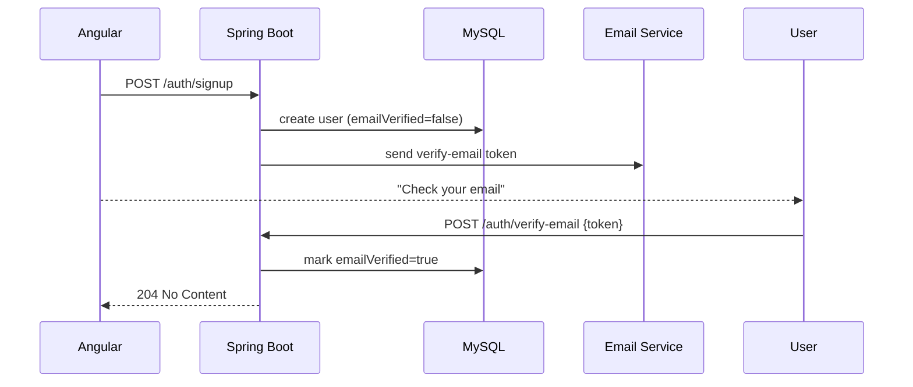
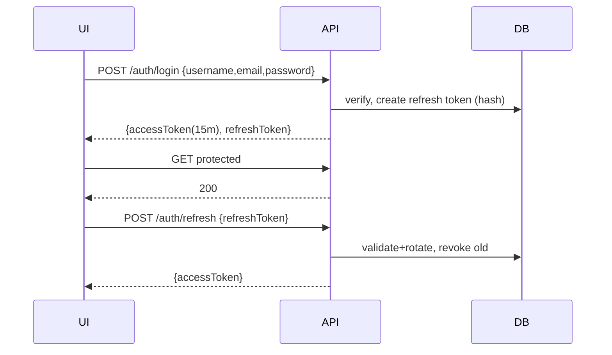
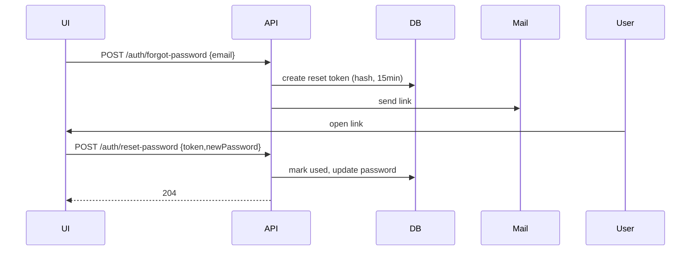
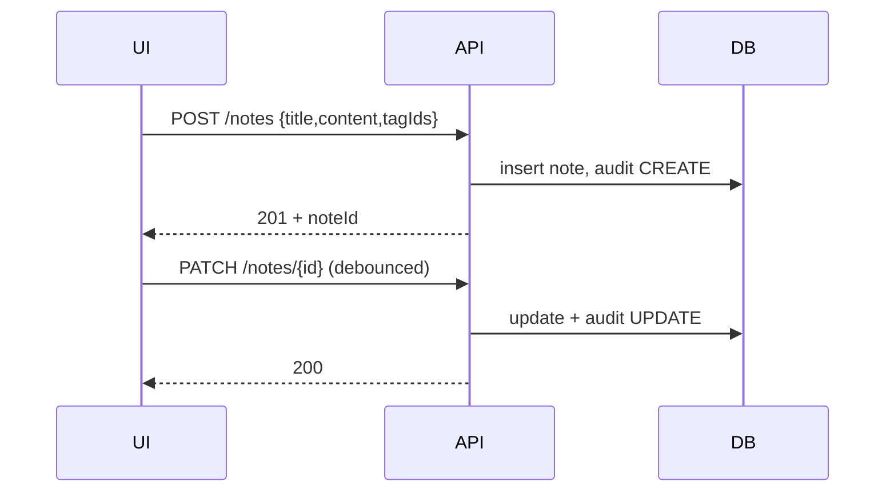
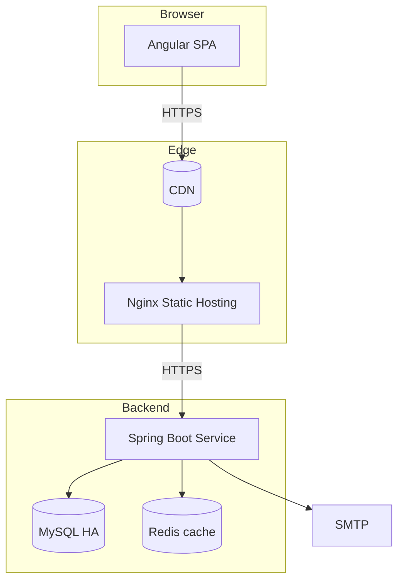

# Personal Notes App — Architecture (Angular + Spring Boot + MySQL)

A secure, extensible notes manager with Bootstrap UI, JWT authentication (login, signup, forgot username/password), and REST APIs backed by Spring Boot + JPA + MySQL.

---

## 1) High‑Level Requirements
- **Users**: signup, email verification (optional toggle), login/logout, refresh tokens, forgot username, forgot/reset password, change password, profile.
- **Notes**: CRUD notes with rich text (Markdown first, WYSIWYG later), tags, notebooks, pin/archive/trash, attachments, search, share via links (future), activity audit.
- **Security**: JWT access + refresh tokens, role-based (USER/ADMIN), device sessions, CSRF not required (token-based), rate limiting, password policy, email OTP for high‑risk actions.
- **Non‑functionals**: mobile-friendly UI (Bootstrap), pagination, observability, testability, CI/CD, 12‑factor configs, backups.

---

## 2) System Context Diagram
```mermaid
flowchart LR
  subgraph Client[Client]
    A[Angular SPA (Bootstrap)]
  end

  subgraph API[Spring Boot App]
    B[Auth Controller]
    C[Notes Controller]
    D[User Controller]
        F[Admin Controller]
    G[Email/OTP Service]
  end

  DB[(MySQL)]
    Mail[SMTP/Email Provider]
  Cache[(Redis - optional)]

  A -- HTTPS/JSON --> API
  API --> DB
  G --> Mail
  API <---> Cache
```

---

## 3) Backend Architecture (Spring Boot)
**Modules (logical packages)**
- `api.auth`: login, signup, refresh, logout, forgot username/password, OTP.
- `api.user`: profile, change password, sessions.
- `api.notes`: notes, notebooks, tags, search, pin/archive/trash.
- `api.attachments`: upload/download/delete, virus scan hook.
- `api.admin`: user mgmt, metrics.
- `core.security`: Spring Security 6, JWT filters, password encoding.
- `core.persistence`: JPA entities, repositories, Flyway migrations.
- `core.mail`: templated emails (Thymeleaf/FreeMarker) + provider adapter.
- `core.common`: exceptions, error model, pagination, auditing.

**Key Libraries**
- Spring Boot Web, Security, Validation, JPA/Hibernate.
- Flyway for DB migrations.
- JSON Web Tokens (jjwt or Nimbus).
- Bucket4j (or Spring Cloud Gateway rate-limiter) for abuse control.
- Lombok/MapStruct (optional), Springdoc OpenAPI.

**Security**
- **Access token**: short TTL (15m). **Refresh token**: 7–30d rolling, stored server‑side (DB) with device fingerprint & revoke.
- BCrypt password hashing, email uniqueness, login attempt throttling.
- CORS: `GET,POST,PUT,PATCH,DELETE` with explicit origins.
- Input validation (Bean Validation) and consistent error envelope.

---

## 4) Data Model (ERD)
```mermaid
erDiagram
  USER ||--o{ NOTE : owns
  USER ||--o{ SESSION : has
  USER ||--o{ REFRESH_TOKEN : issues
  USER ||--o{ PASSWORD_RESET_TOKEN : requests
  USER ||--o{ USER_DEVICE : uses
  NOTE ||--o{ NOTE_TAG : has
  TAG ||--o{ NOTE_TAG : links
    NOTE ||--o{ NOTE_AUDIT : records
  NOTE }o--o{ NOTEBOOK : groups

  USER {
    UUID id
    string email
    string username
    string passwordHash
    string fullName
    enum role
    boolean emailVerified
    datetime createdAt
    datetime updatedAt
    boolean deleted
  }
  NOTE {
    UUID id
    UUID ownerId
    UUID notebookId
    string title
    text contentMarkdown
    boolean pinned
    enum status  // ACTIVE, ARCHIVED, TRASHED
    datetime createdAt
    datetime updatedAt
    datetime deletedAt
  }
  TAG {
    UUID id
    UUID ownerId
    string name
    datetime createdAt
  }
  NOTE_TAG {
    UUID noteId
    UUID tagId
  }
  NOTEBOOK {
    UUID id
    UUID ownerId
    string name
    int position
  }
  REFRESH_TOKEN {
    UUID id
    UUID userId
    string tokenHash
    string userAgent
    string deviceId
    string ip
    datetime expiresAt
    boolean revoked
    datetime createdAt
  }
  PASSWORD_RESET_TOKEN {
    UUID id
    UUID userId
    string tokenHash
    datetime expiresAt
    boolean used
    datetime createdAt
  }
  USER_DEVICE {
    UUID id
    UUID userId
    string deviceId
    string userAgent
    string lastIp
    datetime lastSeenAt
  }
  NOTE_AUDIT {
    UUID id
    UUID noteId
    UUID actorId
    string action // CREATE, UPDATE, ARCHIVE, DELETE, RESTORE
    json diff
    datetime at
  }
  SESSION {
    UUID id
    UUID userId
    string ip
    string userAgent
    datetime loginAt
    datetime logoutAt
  }
```

**Indexes**
- `user.email` unique, `user.username` unique.
- `note(ownerId, status, updatedAt)` for lists.
- `tag(ownerId, name)`, `notebook(ownerId, position)`.
- `refresh_token(tokenHash)`.

---

## 5) API Design (REST)
**Conventions**: `application/json`, snake‑case payload fields or camelCase (pick one and stick). Return RFC‑7807 style `problem+json` errors.

### Auth
- `POST /api/v1/auth/signup` → {email, username, password, fullName}
- `POST /api/v1/auth/login` → {usernameOrEmail, password} ⇒ {accessToken, refreshToken}
- `POST /api/v1/auth/refresh` → {refreshToken} ⇒ {accessToken}
- `POST /api/v1/auth/logout` → revoke current refresh token
- `POST /api/v1/auth/forgot-username` → {email}
- `POST /api/v1/auth/forgot-password` → {email}
- `POST /api/v1/auth/reset-password` → {token, newPassword}
- (Optional) `POST /api/v1/auth/verify-email` → {token}

### Users
- `GET /api/v1/users/me` → profile
- `PATCH /api/v1/users/me` → update name, avatar, timezone
- `POST /api/v1/users/me/change-password` → {currentPassword, newPassword}
- `GET /api/v1/users/me/sessions` → list device sessions
- `DELETE /api/v1/users/me/sessions/{sessionId}` → revoke

### Notes & Organization
- `GET /api/v1/notes` → query params: `q, status, tagId, notebookId, page, size, sort`
- `POST /api/v1/notes` → create
- `GET /api/v1/notes/{id}` → read
- `PUT /api/v1/notes/{id}` / `PATCH /api/v1/notes/{id}` → update
- `DELETE /api/v1/notes/{id}` → soft delete → trash
- `POST /api/v1/notes/{id}:archive` / `:restore` / `:pin`
- `GET /api/v1/notebooks` / `POST /api/v1/notebooks` / `PATCH /api/v1/notebooks/{id}` / `DELETE ...`
- `GET /api/v1/tags` / `POST /api/v1/tags` / `DELETE /api/v1/tags/{id}`

### Admin
- `GET /api/v1/admin/users`
- `GET /api/v1/admin/metrics` (Actuator proxy)

**Error Model** (example)
```json
{
  "type": "https://example.com/prob/validation",
  "title": "Constraint Violation",
  "status": 400,
  "detail": "email must be a valid address",
  "errors": {"email": ["must be a valid address"]}
}
```

---

## 6) Authentication & Authorization
- **JWT Access Token** (15m): `sub`, `uid`, `role`, `iat`, `exp`.
- **Refresh Token** (opaque string, 256‑bit random) stored hashed in DB; rotation on each refresh; reuse‑detection → revoke family.
- **Spring Security Filter Chain**:
  1. CORS →
  2. RateLimit (Bucket4j) →
  3. JWTAuthenticationFilter (extract, validate, set SecurityContext) →
  4. AuthorizationManager (role checks) →
  5. ExceptionTranslation.
- **Password policy**: min 10 chars, common‑password blacklist, breach check (k‑Anon Pwned Passwords optional).
- **Email/OTP**: For reset password and unusual login; token TTL e.g., 15 min.

---

## 7) Angular Application Architecture
**Tech**: Angular 18+, Bootstrap 5, RxJS, Angular Router, HttpClient, interceptors, guards.

**Project Structure**
```
src/app/
  core/            // singletons: AuthService, ApiService, JwtInterceptor, ErrorInterceptor
  shared/          // reusable UI: components, pipes, directives, validators
  features/
    auth/          // login, signup, forgot-username, forgot-password, reset-password, verify-email
    notes/         // list, detail, editor (Markdown), search, filters
    notebooks/     // CRUD & reorder
    tags/          // CRUD
    profile/       // view/update profile, sessions/devices
    admin/         // only for ADMINs
  state/           // (optional) NgRx or simple services with BehaviorSubjects
  app-routing.module.ts
```

**Guards & Interceptors**
- `AuthGuard` (requires auth), `GuestGuard` (unauthed only), `RoleGuard`.
- `JwtInterceptor` (attach token), `AuthRefreshInterceptor` (silent refresh on 401), `ErrorInterceptor` (map RFC7807 to toast), `LoadingInterceptor` (global spinner).

**UI/UX**
- Navbar with search, user menu; left sidebar (Notebooks, Tags, Filters), main content list + editor.
- List: cards with title, preview, tags, updatedAt, pin/archive controls.
- Editor: Markdown (ngx-markdown) + preview, autosave (debounced), tag picker.
- Modals: attach files, move to notebook, share (future).

**State**
- `AuthState`: {user, accessToken, refreshToken?, deviceId}
- `NotesState`: {filters, page, sort, items, selection}
- Persist minimal state to `localStorage` (tokens, last notebook).

---

## 8) Key Sequences

### Signup + Email Verification (optional)


### Login + Token Refresh


### Forgot Password


### Create/Update Note with Autosave


---

## 9) Validation & Error Handling
- Bean Validation annotations on DTOs; map to `problem+json`.
- Global `@ControllerAdvice` → `ApiError` wrapper; correlation id header `X-Request-Id` surfaced to UI logs.
- Angular: toast notifications (ngx-toastr) + field errors.

---

## 10) Configuration & Secrets
- Spring profiles: `dev`, `test`, `prod`.
- Externalize: DB URL, SMTP creds, JWT secrets, CORS origins, attachment storage.
- Use environment variables; never commit secrets. Consider Vault/SOPS.

---

## 11) Deployment Topology


- Containerize with Docker; orchestrate with Kubernetes/OpenShift or simple VM + systemd for small scale.
- Healthchecks: `/actuator/health`, readiness/liveness.
- Observability: Actuator + Micrometer → Prometheus/Grafana; centralized logs.

---

## 12) Security Controls Checklist
- JWT + refresh rotation + reuse detection.
- Strong password rules; email verification; 2FA (future).
- Rate limiting on `/auth/*`.
- Brute-force lockout with temporary cooldown.

- Ownership checks at repository/service layer (multi‑tenant safety).
- Soft delete (Trash) with TTL purge job.
- Regular backups; encrypted storage at rest; TLS everywhere.

---

## 13) OpenAPI & SDKs
- Springdoc: `/v3/api-docs` & `/swagger-ui`. Export client SDKs (TypeScript) during CI; Angular services generated from spec or handwritten.

---

## 14) Testing Strategy
- Unit: JUnit + Mockito.
- Web layer: Spring MockMvc.
- Integration: Testcontainers (MySQL, MinIO, Mailhog).
- E2E: Playwright or Cypress for Angular.

---

## 15) Initial Database Migrations (Flyway)
- `V1__baseline.sql`: users, roles, notes, tags, notebooks, join tables, refresh_tokens, password_reset_tokens, attachments, note_audit, sessions, user_devices.
- Add indices & FKs; use `uuid` (or `binary(16)` in MySQL) for IDs.

---

## 16) Angular Routing (Initial)
```
/
  ├─ /auth
  │   ├─ /login
  │   ├─ /signup
  │   ├─ /forgot-username
  │   ├─ /forgot-password
  │   └─ /reset-password/:token
  ├─ /notes (protected)
  │   ├─ /:id
  │   └─ /new
  ├─ /notebooks (protected)
  ├─ /tags (protected)
  └─ /profile (protected)
```

---

## 17) API DTO Sketches (selected)
```jsonc
// Auth
SignupRequest { email, username, password, fullName }
LoginRequest { usernameOrEmail, password }
LoginResponse { accessToken, refreshToken, user }
ForgotPasswordRequest { email }
ResetPasswordRequest { token, newPassword }

// Notes
NoteCreate { title, contentMarkdown, notebookId?, tagIds? }
NoteSummary { id, title, preview, tags, updatedAt, pinned, status }
NoteDetail  { id, title, contentMarkdown, tags, notebook, pinned, status, createdAt, updatedAt }
```

---

## 18) Build & CI/CD
- Monorepo with `ui/` (Angular) and `api/` (Spring) folders.
- GitHub Actions: build/test both, run unit/integration tests, publish Docker images, deploy to staging, run migrations, then prod.
- Cache node/npm & Maven; code quality via ESLint/Prettier/SpotBugs.

---

## 19) Backlog (MVP → v2)
**MVP**: Auth, Notes CRUD, Tags, Notebooks, Search, Pin/Archive/Trash, Profile.
**v1.1**: Email verification, sessions/devices, admin metrics, rate limit.
**v1.2**: Sharing (read‑only link with token), collaborative editing (future: WebSocket/CRDT), reminders, rich editor.

---

## 20) Environment Matrix
| Concern | Dev | Staging | Prod |
|---|---|---|---|
| DB | MySQL via Testcontainers | Managed MySQL | Managed MySQL HA |
| Storage | — | — | — |
| Mail | Mailhog | SMTP Sandbox | SMTP Provider |
| Auth | Debug keys | Rotated keys | HSM/KMS‑backed keys |
| CORS | localhost:4200 | app‑staging.* | app.* |

---

## 21) Threat Model (brief)
- **Spoofed tokens** → sign with strong key; short TTL; validate claims; rotate refresh tokens; device binding.
- **Account takeover** → email verification, reset token hash + TTL + one‑time use, IP/country anomaly alerts.
- **Data exfiltration** → per‑user row‑level authorization; paging limits; audit trails.
- **Injection** → parameterized queries via JPA; robust validation.
- **Attachments malware** → size/type limits; optional AV scan hook.

---

## 22) Implementation Notes & Next Steps
1) Approve this architecture.
2) Generate OpenAPI spec and Angular service stubs.
3) Scaffold Spring Boot modules + Flyway V1.
4) Scaffold Angular app with routes, guards, interceptors, Bootstrap layout.
5) Wire login/signup → secure notes list → editor with autosave.
6) Add tests, CI, and deployment manifests.

